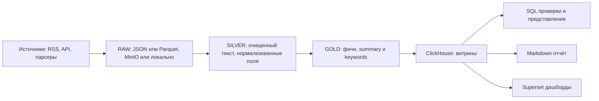
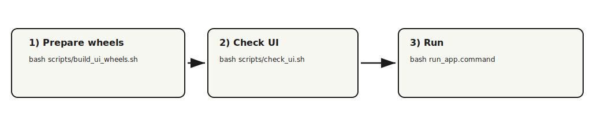

# Media Intelligence Hub

Учебный пет‑проект на стыке **Data Engineering / Data Analytics / NLP**: собираем публикации из медиа‑источников, приводим тексты к единому виду, извлекаем ключевую информацию и строим витрины в ClickHouse для отчётов и BI.

**Статус:** MVP работает: `raw → silver → gold → ClickHouse → (SQL checks + Markdown‑отчёт + Superset + Airflow DAG)`

## Что делает проект

- **Сбор данных** из источников (RSS / API / парсеры; в MVP — минимум один источник).
- **Data Lake** в зонах `raw/silver/gold` (локально и/или S3‑совместимо: MinIO).
- **Обработка текстов**: очистка и нормализация, `summary`, `keywords`, извлечение **персон** и **географии** (NER), а также (опционально) **глаголов‑действий** по персонам.
- **Загрузка витрин** в ClickHouse (батчами, с `batch_id` и дедупликацией).
- **Контроль качества**: базовые SQL‑проверки и «контракты» данных.
- **Отчётность**:
  - Markdown‑отчёт (генерация из ClickHouse по окну времени),
  - BI‑дашборды в Apache Superset поверх витрин/представлений.
- **Оркестрация**: запуск пайплайна в Airflow (DAG), локальные прогоны остаются доступными для отладки.

---

## Архитектура (MVP)


Ключевые принципы:
- **Слои данных** разделены по ответственности: *raw* (как пришло), *silver* (чисто и стабильно), *gold* (готово для аналитики).
- **Повторяемость**: загрузки в ClickHouse сопровождаются `batch_id`, результаты можно воспроизводить и отлаживать.
- **Прозрачность**: каждое преобразование — отдельный шаг пайплайна, проверяемый локально.

---

## Слои данных

### RAW (как пришло)
Назначение: сохранить максимум первичной информации, чтобы можно было переобработать данные, не ходя заново в источник.

Типичные поля (минимум): `source`, `published_at`, `link`, `title`, `raw_text` (+ дополнительные поля по источнику).

### SILVER (очищенный текст)
Назначение: единый формат для последующей NLP‑обработки и витрин.

Типичные преобразования:
- удаление HTML/скриптов/мусора;
- нормализация пробелов и переносов строк;
- приведение даты/времени к согласованному формату и TZ;
- дедупликация *внутри батча* по стабильным признакам (например, `link`).

### GOLD (фичи и витрины для аналитики)
Назначение: всё, что нужно для отчётов/BI без дополнительных вычислений на лету.

Примеры фич (в MVP — часть из них):
- `summary` — краткое саммари;
- `keywords` — ключевые слова (TF‑IDF; строка с разделителем, удобно разбирать через `splitByChar/ARRAY JOIN`);
- `keyphrases` — ключевые фразы (если заполнено; строка с разделителем);
- `lang` — язык текста (например: `ru/en/...`, либо `unknown`, если не определён);
- `sentiment_label`, `sentiment_score` — тональность (лейбл + скор). В текущем MVP тональность для RU считается через `transformers`‑модель `cointegrated/rubert-tiny-sentiment-balanced` (если зависимости установлены). `sentiment_score` хранится с знаком: **positive → +score**, **negative → -score**, **neutral → 0**. Если модель/зависимости недоступны, пайплайн не падает: поля остаются нейтральными (`neu`, `0`).
- `entities_persons` — персоны из текста (NER, строка с `;`‑разделителем);
- `entities_orgs` — организации из текста (NER, строка с `;`‑разделителем);
- `entities_geo` — география/локации из текста (NER, строка с `;`‑разделителем);
- `num_persons`, `num_orgs`, `num_geo` — счётчики сущностей;
- `persons_actions` — действия по персонам *(опционально, включается флагом `--with-actions`)*: формат `person:verb1,verb2|person2:verb1,...`;
- `actions_verbs` — общий список/топ глаголов по статье *(опционально)*, строка с `;`‑разделителем;
- текстовые признаки (длины, простые метрики качества и т.п.);
- агрегаты по времени/источникам (если добавлены).

---

## Обработка текстов: что сделано и куда расширять

В проекте выделены отдельные стадии, чтобы было легко улучшать качество NLP без переписывания всего пайплайна:

1) **Очистка и нормализация**  
   Превращаем «грязный» HTML/описания RSS в чистый текст и устойчивые метаданные.

2) **Суммаризация (summary)**  
   В MVP — быстрый вариант (extractive/правила). Дальше можно расширять до LLM‑саммари/мультиязычности.

3) **Ключевые слова/фразы (keywords)**  
   В MVP — TF‑IDF. Дальше логично добавить:
   - ключевые фразы (n‑граммы, RAKE/YAKE),
   - лемматизацию (если нужен русский),
   - стоп‑словари под домен (новости/технологии/политика и т.д.).

4) **Мультиязычность и тональность (lang / sentiment)**  
   Определяем язык текста (`lang`) и тональность (`sentiment_label`, `sentiment_score`). Это помогает строить BI‑срезы и улучшать дедуп (предпочитать строки с заполненным NLP‑обогащением).

5) **Дедупликация**  
   Есть дедуп *внутри батча* на этапе silver/gold; в ClickHouse — отдельный слой/представление для аналитики.

6) **NER: сущности (persons/orgs/geo)**  
   Извлекаем сущности из текста через **Natasha NER** (типы `PER` и `LOC`) и приводим к канонической форме (чистка + лемматизация; для гео есть минимальная унификация через `GEO_SYNONYMS`).  
   Дополнительно, на уровне **батча**, делаем «склейку» однословных упоминаний по фамилии в полное имя (если в батче встречается вариант из ≥2 слов).

7) **Действия: глаголы рядом с персонами (persons_actions / actions_verbs)** *(опционально)*  
   Если запустить `silver_to_gold_local.py` с флагом `--with-actions`, то для предложений, где встречается персона, извлекаем **леммы глаголов** (через `pymorphy2`, POS `VERB/INFN`) и собираем:
   - `persons_actions` — глаголы по каждой персоне (компактный строковый формат),
   - `actions_verbs` — общий top глаголов по статье.

Примечание: если NLP‑зависимости не установлены (например, `transformers/torch`), пайплайн не падает, а соответствующие поля остаются нейтральными/пустыми.

---

## Зависимости (важное)

Проект намеренно держит NLP‑часть **опциональной**: базовый ETL работает без «тяжёлых» зависимостей, а расширенные поля (тональность, NER‑фичи и т.п.) заполняются при наличии библиотек.

Установка:
```bash
# Важно: используйте python3 -m pip, чтобы ставить в то же окружение, из которого запускается пайплайн
python3 -m pip install -r requirements-base.txt
# опционально, для NLP-фич
python3 -m pip install -r requirements-nlp.txt
```

Опциональные NLP-зависимости (при отсутствии пайплайн не падает, поля остаются пустыми/нейтральными):
- **NER (персоны/гео):** `natasha`
- **Sentiment (RU):** `transformers`, `torch`, `sentencepiece`
- **Keyphrases (YAKE):** `yake` *(если используешь этот путь в будущем)*
- **Lang detect:** `langid`

### Tonality (RU) через Transformers
Минимум для корректной работы тональности на русском:
- `transformers`, `torch`, `sentencepiece`

Первый запуск может скачать модель в кэш Hugging Face. В Docker‑окружении кэш вынесен в отдельный volume и шарится между контейнерами Airflow, чтобы избежать повторных загрузок и ускорить прогон.
Если `transformers` установлены, TG‑источники принудительно используют Transformers (без падения в лексикон), чтобы избежать низкого `confidence` на коротких/шумных текстах.

Для воспроизводимости предусмотрены переменные окружения:
- `HF_HOME` и `TRANSFORMERS_CACHE` — путь к кэшу;
- `HF_HUB_OFFLINE=1` и `TRANSFORMERS_OFFLINE=1` — строгий офлайн‑режим (включается после прогрева кэша);
- `TOKENIZERS_PARALLELISM=false` и ограничения потоков (`OMP_NUM_THREADS=1`, `OPENBLAS_NUM_THREADS=1`, `MKL_NUM_THREADS=1`) — чтобы снизить нагрузку и избежать OOM‑kill в контейнерах при параллельных задачах.

Прогрев модели вручную (один раз, чтобы потом работать офлайн):
```bash
python3 - <<'PY'
from transformers import pipeline
pipe = pipeline("text-classification", model="cointegrated/rubert-tiny-sentiment-balanced", tokenizer="cointegrated/rubert-tiny-sentiment-balanced", truncation=True)
print(pipe("Тестовый текст."))
PY
```

### Морфология (лемматизация/действия)
Для морфологии (лемматизация в эвристиках/действиях):
- `pymorphy2`, `pymorphy2-dicts-ru`

Рекомендация по воспроизводимости окружения:
- зафиксировать `setuptools<81` (у `pymorphy2` встречается предупреждение про `pkg_resources`, которое в будущих версиях `setuptools` может стать ошибкой).

Важно: `dostoevsky` в проекте не является обязательной и по умолчанию не используется (часто требует сборки `fasttext`/C++ и дополнительных build‑зависимостей; на Python 3.12/macOS нередко не ставится «в один шаг»). Поэтому в MVP тональность реализована через `transformers`.

### NLP coverage и quality gate
В проекте есть скрипты для оценки покрытия NLP и пороговой проверки качества:
```bash
python3 scripts/nlp_coverage_report.py
python3 scripts/nlp_quality_gate.py
```
Результаты пишутся в `reports/nlp_coverage_report_<YYYY-MM-DD>.md` и `.json`.
Пороги можно переопределить:
`NLP_LANG_OK_MIN`, `NLP_KP_OK_MIN`, `NLP_SENT_OK_MIN`.

---

## ClickHouse: витрины и проверки

ClickHouse — основной аналитический слой. Типичный набор сущностей (по текущему MVP):

- `media_intel.articles` — основная таблица загрузки (gold‑данные по материалам).
- `media_intel.load_log` — журнал загрузок: `layer`, `object_name`, `loaded_at`, `rows_loaded`  
  Примечание: при локальной загрузке gold (`gold_to_clickhouse_local.py`) запись в `load_log` создаётся автоматически после успешного INSERT.
- `media_intel.articles_dedup` — представление для аналитики с устранением дублей (argMax по score).  
  Score учитывает наличие тела/длину, приоритет батча и наличие NLP‑обогащения (например `lang != 'unknown'`, `keyphrases`/`sentiment_*`).

Витрины для действий (из `persons_actions/actions_verbs`):
- `v_persons_actions_flat`, `v_actions_verbs_flat` — развёрнутые «плоские» строки для BI;
- `v_persons_actions_hourly`, `v_actions_verbs_hourly` — агрегации по часу;
- `v_persons_actions_events`, `v_actions_verbs_events` — «события»/топы за окно.

SQL‑проверки (quality gates) подключаются как отдельные запросы/скрипты:
- проверка доступности ClickHouse (`/ping`);
- базовые проверки заполненности/валидности дат;
- sanity‑checks по количеству строк за окно времени;
- проверки дублей и корректности ключевых полей.

---

## BI в Apache Superset

Superset подключается к ClickHouse и использует витрины/представления как датасеты.

Примеры визуализаций, которые хорошо ложатся на текущую модель данных:
- **Keyword trends**: динамика ключевых слов/фраз по времени (разбор `keywords`/`keyphrases` + `published_at`);
- **Language distribution**: распределение материалов по `lang`;
- **Sentiment trends**: тональность по времени/источникам (`sentiment_label`, `sentiment_score`);
- **Entities (persons/orgs/geo)**: динамика/топ сущностей по времени и источникам (`entities_persons`, `entities_orgs`, `entities_geo`);
- **Top sources**: распределение материалов по источникам;
- **Articles table**: таблица материалов (title/link/source/published_at) для просмотра первички в BI;
- **Actions** *(опционально)*: какие глаголы чаще всего встречаются рядом с персонами (витрины `v_persons_actions_*`, `v_actions_verbs_*`).

---

## Запуск локально (high level)

Проект запускается через Docker Compose. По умолчанию поднимаются: ClickHouse, MinIO, Airflow и Superset.

Типовой сценарий:
1) поднять инфраструктуру (`make up`);
2) прогнать схему/представления ClickHouse (`make ch-show-schema` или `make views`);
3) прогнать ETL (локально или через Airflow DAG);
4) убедиться, что данные появились в ClickHouse;
5) открыть Superset и собрать/посмотреть дашборды;
6) (опционально) сгенерировать Markdown‑отчёт из ClickHouse.

---

## Локальный UI для нетехнических пользователей (без Docker)

**Быстрый старт (3 команды):**
```bash
bash scripts/build_ui_wheels.sh
bash scripts/check_ui.sh
bash run_app.command
```
Откройте `http://localhost:8501`.




Если нужно просто настроить RSS и Telegram‑каналы без терминала:

1) один раз (на машине с интернетом) выполните подготовку offline‑пакетов:
   `scripts/build_ui_wheels.sh`
2) дважды кликните `run_app.command` в корне проекта;
3) откройте `http://localhost:8501` и настройте источники.


Примечание по сбору: кнопка **Run collection** запускает локальные сборщики.
RSS работает из коробки в UI-окружении, Telegram требует Selenium и установленный драйвер браузера.

Результаты коллекции сохраняются локально в `data/raw/`.
Результаты обогащения (полные тексты) сохраняются в `data/raw_enriched/`.

В UI есть кнопка **Run body enrichment**: она скачивает тексты статей по ссылкам
и сохраняет файл в `data/raw_enriched/`.

В UI есть блок **NLP (gold) quick view**:
- кнопка **Run NLP for latest data (RSS)** запускает цепочку `raw/silver -> gold`;
- результаты сохраняются в `data/gold/*.parquet` и сразу показываются в карточке;
- для полной NLP‑наполняемости установите `requirements-nlp.txt` (иначе часть полей будет пустой/нейтральной).


UI редактирует файлы:
- `config/settings.yaml` (RSS);
- `config/telegram_channels.txt` (Telegram).

Требования: macOS + установленный Python 3.10+.

Если вы обновляете `requirements-ui.txt`, обязательно повторно запустите
`scripts/build_ui_wheels.sh`, чтобы обновить локальные wheels и lock-файл.


Проверка локального UI (без сети):
- `scripts/check_ui.sh`

Проверка на утечки секретов (gitleaks):
- `gitleaks detect --no-git --source . --config gitleaks.toml --report-format json --report-path /tmp/gitleaks-worktree.json`
- `gitleaks detect --config gitleaks.toml --report-format json --report-path /tmp/gitleaks-history.json`


### Offline‑режим и безопасность

`run_app.command` устанавливает зависимости **только из локальных wheels** и
строго проверяет SHA256‑хэши (без доступа к сети).

Скрипт подготовки (требуется интернет один раз):
- `scripts/build_ui_wheels.sh`

Он:
- скачивает wheels в `vendor/wheels/arm64`;
- создаёт lock‑файл `requirements-ui.arm64.lock` c SHA256 для каждого пакета.

Поддерживаемая архитектура UI сейчас: только **arm64 (Apple Silicon)**.

Безопасность UI:
- `run_app.command` устанавливает зависимости **только из локальных wheels** и проверяет SHA256‑хэши.
- если у пакета нет wheel, в офлайн‑папку попадает исходный архив (pure‑python) с SHA256;
- `.home/` и `.streamlit/` используются локально, не трогают системные директории.
- Телеметрия Streamlit отключена, email‑prompt отключён.

Важно по безопасности и воспроизводимости:
- wheels лучше хранить вне git и распространять вместе с релизным архивом/дистрибутивом;
- в git достаточно держать lock‑файл с SHA256 и скрипт сборки.

Важно: если Airflow вынесен в отдельный compose‑файл (например, `docker-compose.airflow.yml`), то команды нужно запускать с флагом `-f`, либо пользоваться `Makefile`, где это уже зашито.

UI по умолчанию (если не переопределено в `.env`):
- Airflow: `http://localhost:${AIRFLOW_WEBSERVER_PORT:-8080}` (таймзона UI и семантика расписания: `Europe/Vilnius`)
- Superset: `http://localhost:${SUPERSET_PORT:-18088}`

> Подробные команды остаются в `Makefile` и скриптах репозитория (цель — один‑два `make …` для типового сценария).

---

## Переменные окружения

Проект использует `.env` в корне репозитория.

### Переменные окружения не подхватываются
Проверь, что `.env` лежит в корне:
```bash
ls -la .env
```

---

## Репозиторий: куда смотреть

- `src/collectors/` — сбор данных из источников
- `src/processing/` — очистка и NLP‑обогащение (silver/gold)
- `src/pipeline/` — пайплайны и локальные прогонки слоёв
- `src/reporting/` — генерация отчётов (Markdown)
- `sql/` — DDL/представления/quality‑checks
- `docker-compose*.yml` и `docker/*` — инфраструктура (ClickHouse/Airflow/Superset/MinIO)
- `reports/` — результаты генерации отчётов

---

## Roadmap

Ближайшие улучшения:
- расширить источники (несколько RSS/API/Telegram) + логирование покрытия
- улучшить NLP: тематические кластеры и дальнейшее качество (ключевые фразы/мультиязычность/тональность уже заведены в MVP)
- витрины ClickHouse под BI (отдельные materialized views под Superset)
- регулярные отчёты по расписанию + уведомления
- эмбеддинги и похожие материалы (near‑duplicate / clustering)
