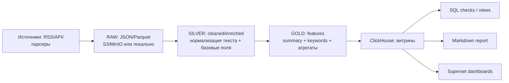

# Media Intelligence Hub

Учебный пет‑проект на стыке **Data Engineering / Data Analytics / NLP**: собираем публикации из медиа‑источников, приводим тексты к единому виду, извлекаем ключевую информацию и строим витрины в ClickHouse для отчётов и BI.

**Статус:** MVP работает: `raw → silver → gold → ClickHouse → (SQL checks + Markdown‑отчёт + Superset)`

## Что делает проект

- **Сбор данных** из источников (RSS / API / парсеры; в MVP — минимум один источник).
- **Data Lake** в зонах `raw/silver/gold` (локально и/или S3‑совместимо: MinIO).
- **Обработка текстов**: очистка и нормализация, `summary`, `keywords`, извлечение **персон** и **географии** (NER), а также (опционально) **глаголов‑действий** по персонам.
- **Загрузка витрин** в ClickHouse (батчами, с `batch_id` и дедупликацией).
- **Контроль качества**: базовые SQL‑проверки и «контракты» данных.
- **Отчётность**:
  - Markdown‑отчёт (генерация из ClickHouse по окну времени),
  - BI‑дашборды в Apache Superset поверх витрин/представлений.

---

## Архитектура (MVP)



Ключевые принципы:
- **Слои данных** разделены по ответственности: *raw* (как пришло), *silver* (чисто и стабильно), *gold* (готово для аналитики).
- **Повторяемость**: загрузки в ClickHouse сопровождаются `batch_id`, результаты можно воспроизводить и отлаживать.
- **Прозрачность**: каждое преобразование — отдельный шаг пайплайна, проверяемый локально.

---

## Слои данных

### RAW (как пришло)
Назначение: сохранить максимум первичной информации, чтобы можно было переобработать данные, не ходя заново в источник.

Типичные поля (минимум): `source`, `published_at`, `link`, `title`, `raw_text` (+ дополнительные поля по источнику).

### SILVER (очищенный текст)
Назначение: единый формат для последующей NLP‑обработки и витрин.

Типичные преобразования:
- удаление HTML/скриптов/мусора;
- нормализация пробелов и переносов строк;
- приведение даты/времени к согласованному формату и TZ;
- дедупликация *внутри батча* по стабильным признакам (например, `link`).

### GOLD (фичи и витрины для аналитики)
Назначение: всё, что нужно для отчётов/BI без дополнительных вычислений на лету.

Примеры фич (в MVP — часть из них):
- `summary` — краткое саммари;
- `keywords` — ключевые слова/фразы (TF‑IDF; хранение через разделитель, чтобы удобно было `ARRAY JOIN`);
- `persons` — персоны из текста (NER, `;`‑разделитель);
- `geo` — география/локации из текста (NER, `;`‑разделитель; есть минимальная унификация через словарь синонимов);
- `persons_actions` — действия по персонам (опционально, включается флагом `--with-actions`): формат `person:verb1,verb2|person2:verb1,...`;
- `actions_verbs` — общий top глаголов по статье (опционально, `;`‑разделитель);
- текстовые признаки (длины, простые метрики качества и т.п.);
- агрегаты по времени/источникам (если добавлены).

---

## Обработка текстов: что сделано и куда расширять

В проекте выделены отдельные стадии, чтобы было легко улучшать качество NLP без переписывания всего пайплайна:

1) **Очистка и нормализация**  
   Превращаем «грязный» HTML/описания RSS в чистый текст и устойчивые метаданные.

2) **Суммаризация (summary)**  
   В MVP — быстрый вариант (extractive/правила). Дальше можно расширять до LLM‑саммари/мультиязычности.

3) **Ключевые слова/фразы (keywords)**  
   В MVP — TF‑IDF. Дальше логично добавить:
   - ключевые фразы (n‑граммы, RAKE/YAKE),
   - лемматизацию (если нужен русский),
   - стоп‑словари под домен (новости/технологии/политика и т.д.).

4) **Дедупликация**  
   Есть дедуп *внутри батча* на этапе silver/gold; в ClickHouse — отдельный слой/представление для аналитики.

5) **NER: персоны и география (persons / geo)**  
   Извлекаем сущности из текста через **Natasha NER** (типы `PER` и `LOC`) и приводим к канонической форме (чистка + лемматизация; для гео есть минимальная унификация через `GEO_SYNONYMS`).  
   Дополнительно, на уровне **батча**, делаем «склейку» однословных упоминаний по фамилии в полное имя (если в батче встречается вариант из ≥2 слов).

6) **Действия: глаголы рядом с персонами (persons_actions / actions_verbs)** *(опционально)*  
   Если запустить `silver_to_gold_local.py` с флагом `--with-actions`, то для предложений, где встречается персона, извлекаем **леммы глаголов** (через `pymorphy2`, POS `VERB/INFN`) и собираем:
   - `persons_actions` — глаголы по каждой персоне (компактный строковый формат),
   - `actions_verbs` — общий top глаголов по статье.

Примечание: если NLP‑зависимости не установлены, пайплайн не падает, а соответствующие поля остаются пустыми.

---

## ClickHouse: витрины и проверки

ClickHouse — основной аналитический слой. Типичный набор сущностей (по текущему MVP):

- `media_intel.articles` — основная таблица загрузки (gold‑данные по материалам).
- `media_intel.load_log` — журнал загрузок (batch_id, метрики/статусы).
- `media_intel.articles_dedup` — слой/представление для аналитики с устранением дублей.

SQL‑проверки (quality gates) подключаются как отдельные запросы/скрипты:
- проверка доступности ClickHouse (`/ping`);
- базовые проверки заполненности/валидности дат;
- sanity‑checks по количеству строк за окно времени;
- проверки дублей и корректности ключевых полей.

---

## BI в Apache Superset

Superset подключается к ClickHouse и использует витрины/представления как датасеты.

Примеры визуализаций, которые хорошо ложатся на текущую модель данных:
- **Keyword trends**: динамика ключевых слов по времени (разбор `keywords` + `published_at`);
- **Person trends**: динамика упоминаний персон (`persons`) по времени и источникам;
- **Geo trends**: топ‑локации и динамика географии (`geo`) — как список/бар‑чарт (а при желании — карта, если нормализовать гео в отдельную справочную таблицу);
- **Top sources**: распределение материалов по источникам;
- **Articles table**: таблица материалов (title/link/source/published_at) для просмотра первички в BI;
- *(опционально)* **Actions**: какие глаголы чаще всего встречаются рядом с персонами (`persons_actions`, `actions_verbs`).

---

## Запуск локально (high level)

Проект предполагает запуск сервисов через Docker Compose (ClickHouse, MinIO, Airflow, Superset — отдельным compose‑файлом).

Общий принцип:
1) поднять инфраструктуру;
2) проверить переменные окружения;
3) прогнать ETL (локально или через Airflow DAG);
4) убедиться, что данные появились в ClickHouse;
5) открыть Superset и собрать/посмотреть дашборды;
6) сгенерировать Markdown‑отчёт из ClickHouse.

> Подробные команды остаются в `Makefile` и скриптах репозитория (цель — один‑два «make …» для типового сценария).

---

## Переменные окружения

Проект использует `.env` в корне репозитория.

### Переменные окружения не подхватываются
Проверь, что `.env` лежит в корне:
```bash
ls -la .env
```

---

## Репозиторий: куда смотреть

- `src/collectors/` — сбор данных из источников
- `src/processing/` — очистка и NLP‑обогащение (silver/gold)
- `src/pipeline/` — пайплайны и локальные прогонки слоёв
- `src/reporting/` — генерация отчётов (Markdown)
- `sql/` — DDL/представления/quality‑checks
- `docker-compose*.yml` и `docker/*` — инфраструктура (ClickHouse/Airflow/Superset/MinIO)
- `reports/` — результаты генерации отчётов

---

## Roadmap

Ближайшие улучшения (в порядке «максимум эффекта на портфолио»):
- расширить источники (несколько RSS/API/Telegram) + логирование покрытия
- улучшить NLP: ключевые фразы, мультиязычность, тональность, тематические кластеры
- витрины ClickHouse под BI (отдельные materialized views под Superset)
- регулярные отчёты по расписанию + уведомления
- эмбеддинги и похожие материалы (near‑duplicate / clustering)
